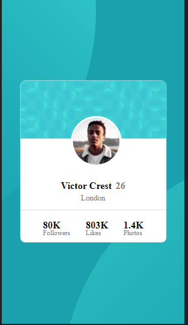

# Frontend Mentor - FAQ accordion card solution

Esta é uma solução do [FAQ accordion card challenge on Frontend Mentor](https://www.frontendmentor.io/challenges/faq-accordion-card-XlyjD0Oam). Frontend Mentor challenges ajuda você melhorar suas habilidades em fazer códigos com projetos reais.

### 💻 Telas

### Links

[Solution URL](https://kaiojesus.github.io/Profile-card/assets/index.html)

### Ferramentas

- HTML 5
- CSS

### 📝 Aprendizado

Aprimoramento das habilidades de css e html. Utilizando flexbox e outras ferramentas.

### Contato ✉

- [LinkedIn](https://www.linkedin.com/in/kaio-jesus/) 
- [kaiojesus41@gmail.com](kaiojesus41@gmail.com)

